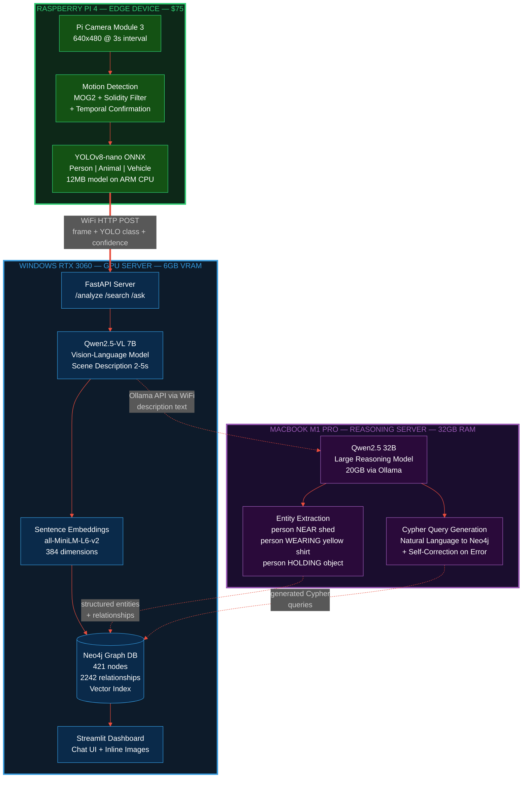
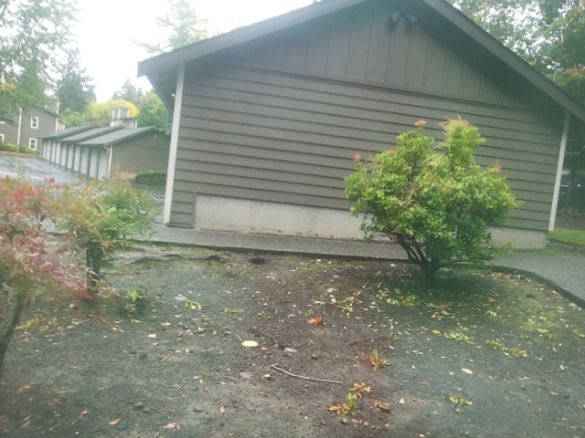
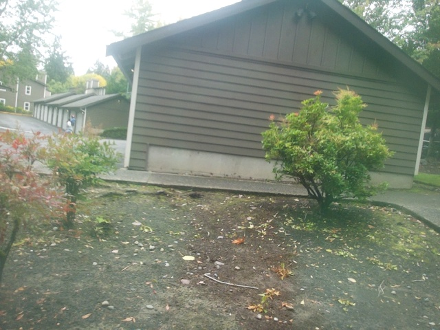
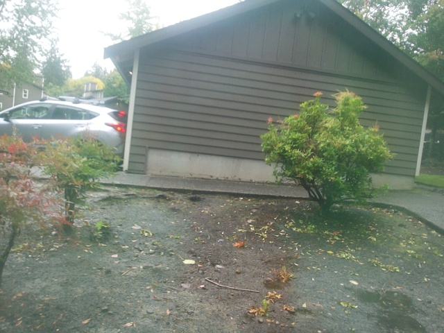
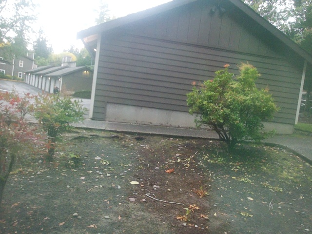
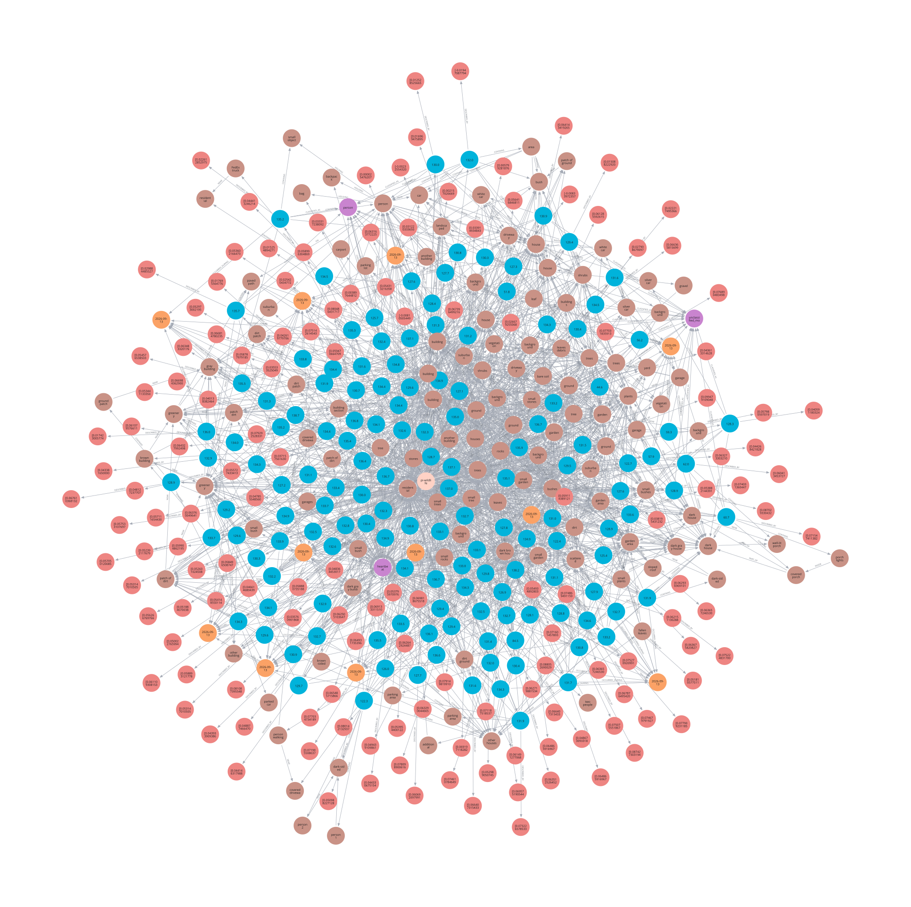

# AntVision — Multi-Device AI Activity Monitor

A distributed AI system that captures, understands, and queries real-world activity using computer vision, vision-language models, and a knowledge graph — running locally across 3 devices.

Started as an ant behavior observation system, evolved into a full-stack AI monitoring pipeline.

**[Live Showcase](docs/showcase.html)** | **[Demo Video](docs/chat_database.mp4)** | **[Project Deep Dive](docs/PROJECT_SHOWCASE.md)**

---

## System Architecture



---

## Sample Captures

### Heartbeat — Scheduled Capture (11:04 AM)


No activity detected. Background scene captured every 5 minutes as a baseline.

### Person Detected (4:34 PM)


YOLOv8-nano detected a person near the building. Frame sent to VLM for scene description.

### Motion Triggered — Vehicle (9:24 AM)


Motion detection triggered by vehicle movement. Solidity filter confirmed real motion.

### Person Detected (6:44 PM)


Person detected near the carport. Entity extraction identified: person, building, greenery.

---

## AI Pipeline Output — From Pixels to Knowledge

### Step 1: VLM Image Description (Qwen2.5-VL 7B)

The camera frame is sent to the Vision-Language Model, which generates a rich natural language description:

```
Input:  Camera frame (640x480 JPEG) + YOLO class: "person" (94%)

Output: "A person in a yellow and gray t-shirt standing outdoors in a
         residential area, holding a small object in their right hand.
         The background shows a building with a sloped roof, some
         greenery, and a gravel path. The lighting suggests an overcast
         day with diffused natural light."
```

### Step 2: Entity Extraction (Qwen2.5 32B)

The 32B reasoning model reads the VLM description and extracts structured entities and relationships:

```
Input:  VLM description text

Output:
  Entities:
    [person]   "person"     — attributes: yellow shirt, gray t-shirt, dark shorts
    [location] "building"   — attributes: sloped roof, residential
    [object]   "small object" — attributes: held in right hand
    [location] "gravel path"  — attributes: near building

  Relationships:
    person  → NEAR     → building
    person  → HOLDING  → small object
    person  → WEARING  → yellow shirt
    building → HAS     → sloped roof
```

### Step 3: Query Agent (Natural Language to Cypher)

Ask a question in plain English, the 32B model generates a Neo4j Cypher query:

```
User:   "Who was near the building at 11am?"

Generated Cypher:
  MATCH (obs:Observation)-[:CONTAINS]->(e:Entity)
  WHERE e.name = 'person'
  AND obs.timestamp >= datetime('2026-09-13T11:00:00')
  AND obs.timestamp < datetime('2026-09-13T12:00:00')
  MATCH (obs)-[:CONTAINS]->(loc:Entity)
  WHERE loc.name = 'building'
  RETURN obs.timestamp, e.name, e.attributes, loc.name

Answer: "At 11:05 AM on September 13, a person wearing a yellow and gray
         t-shirt and dark shorts was detected standing near the building,
         holding a small object in their right hand."
```

If the generated Cypher has a syntax error, the error is fed back to the model and it self-corrects (up to 2 retries).

---

## What It Does

1. **Captures** — Pi Camera grabs frames every 3 seconds, runs motion detection with solidity filtering to ignore leaves and wind
2. **Classifies** — YOLOv8-nano (ONNX) runs on-device to identify people vs. animals vs. unclassified motion
3. **Describes** — Frames are sent to a GPU server running Qwen2.5-VL 7B, which generates rich natural language scene descriptions
4. **Extracts** — A 32B reasoning model extracts structured entities (person, vehicle, clothing, objects) and relationships
5. **Stores** — Everything goes into a Neo4j knowledge graph with vector embeddings for semantic search
6. **Queries** — Natural language query agent generates Cypher, self-corrects on errors, and explains results
7. **Displays** — Streamlit dashboard shows chat interface with inline images and graph stats

---

## Technical Highlights

### Edge AI on Raspberry Pi
- Background subtraction (MOG2) with solidity filtering to reject jagged leaf contours
- Multi-frame temporal confirmation for robust detection
- YOLOv8-nano exported to ONNX format for ARM compatibility (no PyTorch on Pi)
- Non-blocking frame upload via background threads — detection pipeline never waits for VLM

### Vision-Language Model Pipeline
- Qwen2.5-VL 7B on RTX 3060 GPU for scene understanding (~2-5s per frame)
- Rich descriptions: clothing colors, actions, spatial relationships, object counts
- 384-dimensional sentence embeddings (all-MiniLM-L6-v2) for semantic search

### Knowledge Graph (Neo4j)



- 6 node types: Camera, Observation, Species, TimeWindow, Description, Entity
- 7+ relationship types: CAPTURED, CLASSIFIED_AS, OCCURRED_DURING, DESCRIBED_BY, CONTAINS, NEAR, WEARING
- Vector index on Description embeddings for cosine similarity search
- Entity extraction creates queryable attributes (clothing, actions, positions)

### Agentic Query System
- 32B reasoning model generates Cypher queries from natural language
- Self-correction: if a query fails, the error is fed back to the model to fix
- Combines graph traversal with vector search for hybrid retrieval
- Streamlit chat UI with inline image display

---

## Tech Stack

| Layer | Technology |
|-------|-----------|
| Camera | Raspberry Pi 4 + Pi Camera Module 3 |
| Motion Detection | OpenCV MOG2 + contour analysis |
| Object Detection | YOLOv8-nano (ONNX Runtime) |
| Vision-Language Model | Qwen2.5-VL 7B (Ollama) |
| Reasoning Model | Qwen2.5 32B (Ollama) |
| Text Embeddings | all-MiniLM-L6-v2 (sentence-transformers) |
| Graph Database | Neo4j with vector index |
| API Server | FastAPI + Uvicorn |
| Dashboard | Streamlit |
| Communication | HTTP REST + API key auth |

---

## Project Structure

```
antvision/
├── wildlife/                  # Pi edge pipeline
│   ├── main.py               # Main capture loop with YOLO + vision server
│   ├── smart_motion.py       # MOG2 + solidity + temporal confirmation
│   ├── classify.py           # YOLOv8 ONNX classifier
│   ├── daylight.py           # Brightness-based day/night detection
│   ├── storage_manager.py    # Disk management + cleanup
│   └── data_logger.py        # CSV event logging
├── vision_server/             # GPU server
│   ├── server.py             # FastAPI (VLM + Neo4j + search + query agent)
│   ├── vlm.py                # Qwen2.5-VL wrapper via Ollama
│   ├── embeddings.py         # Sentence-transformer embeddings
│   ├── entity_extractor.py   # LLM entity/relationship extraction
│   ├── neo4j_store.py        # Graph database operations + vector search
│   ├── query_agent.py        # Natural language -> Cypher -> results
│   └── config.py             # Multi-host Ollama configuration
├── dashboard/                 # Web UI
│   └── app.py                # Streamlit chat dashboard with images
├── edge/                      # Camera drivers + image upload
├── cloud/                     # AWS infrastructure (Terraform)
├── wildlife_vision.sh         # Pi start/stop/status script
└── docs/
    ├── WILDLIFE_VISION_SYSTEM.md
    └── ADVANCED_AI_SYSTEMS_GUIDE.md
```

---

## Running the System

### Pi (Edge)
```bash
./wildlife_vision.sh start     # run in background
./wildlife_vision.sh logs      # watch detections live
./wildlife_vision.sh stop      # stop
```

### Windows GPU Server
```bash
cd vision_server
python server.py
```

### Dashboard
```bash
streamlit run dashboard/app.py
```

### Example Queries
Ask in the Streamlit chat:
- "What happened at 11am today?"
- "Show me all people detected"
- "Yellow shirt person details"
- "Any animals spotted?"
- "What was near the building this morning?"

---

## Concepts Demonstrated

| Concept | Implementation |
|---------|---------------|
| Edge AI Inference | YOLOv8-nano ONNX on Raspberry Pi ARM |
| Vision-Language Models | Qwen2.5-VL 7B for scene description |
| Distributed AI Systems | 3 devices with role-based compute split |
| Knowledge Graphs | Neo4j with entities, relationships, vector index |
| RAG Pipeline | Embeddings + semantic search + LLM explanation |
| Agentic AI | LLM generates Cypher, self-corrects on failure |
| Real-time Processing | Camera -> detection -> VLM -> graph pipeline |
| Model Serving | Ollama as inference server across network |
| Quantization Tradeoffs | 3B vs 7B vs 32B, VRAM-aware deployment |
| Full-stack AI | Streamlit + FastAPI + Neo4j + edge devices |

---

## Evolution

```
Phase 1: Ant observation with Pi Camera + OpenCV
Phase 2: Wildlife monitoring with smart motion detection
Phase 3: Person detection with YOLOv8 on Pi
Phase 4: VLM scene descriptions on GPU server
Phase 5: Neo4j knowledge graph with vector search
Phase 6: Entity extraction and relationship mapping
Phase 7: Natural language query agent with self-correction
Phase 8: Streamlit dashboard with chat UI
```

---

## License

This project is intended as an experimental and educational project.
