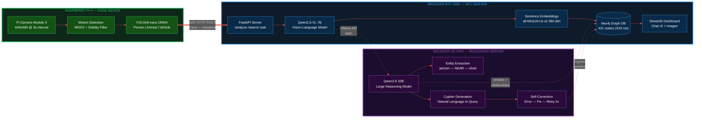

```mermaid
%%{init: {'theme': 'dark', 'themeVariables': {'primaryColor': '#1a1a2e', 'primaryTextColor': '#fff', 'primaryBorderColor': '#3498db', 'lineColor': '#e74c3c', 'secondaryColor': '#16213e', 'tertiaryColor': '#0f3460', 'fontSize': '14px'}}}%%

flowchart LR
    subgraph PI["RASPBERRY PI 4 — EDGE DEVICE"]
        direction TB
        CAM["Pi Camera Module 3\n640x480 @ 3s interval"]
        MOT["Motion Detection\nMOG2 + Solidity Filter"]
        YOLO["YOLOv8-nano ONNX\nPerson | Animal | Vehicle"]
        CAM --> MOT --> YOLO
    end

    subgraph WIN["WINDOWS RTX 3060 — GPU SERVER"]
        direction TB
        API["FastAPI Server\n/analyze  /search  /ask"]
        VLM["Qwen2.5-VL 7B\nVision-Language Model"]
        EMB["Sentence Embeddings\nall-MiniLM-L6-v2  384-dim"]
        NEO[("Neo4j Graph DB\n421 nodes  2242 rels")]
        DASH["Streamlit Dashboard\nChat UI + Images"]
        API --> VLM --> EMB --> NEO
        NEO --> DASH
    end

    subgraph MAC["MACBOOK M1 PRO — REASONING SERVER"]
        direction TB
        LLM["Qwen2.5 32B\nLarge Reasoning Model"]
        ENT["Entity Extraction\nperson — NEAR — shed"]
        CYP["Cypher Generation\nNatural Language to Query"]
        FIX["Self-Correction\nError — Fix — Retry 2x"]
        LLM --> ENT
        LLM --> CYP --> FIX
    end

    YOLO ==>|"WiFi HTTP POST\nframe + metadata"| API
    VLM -.->|"Ollama API\nWiFi"| LLM
    LLM -.->|"entities +\nrelationships"| NEO
    FIX -.->|"Cypher\nqueries"| NEO

    style PI fill:#0d2818,stroke:#2ecc71,stroke-width:3px,color:#2ecc71
    style WIN fill:#0d1b2a,stroke:#3498db,stroke-width:3px,color:#3498db
    style MAC fill:#1a0d2e,stroke:#9b59b6,stroke-width:3px,color:#9b59b6

    style CAM fill:#145214,stroke:#2ecc71,color:#fff
    style MOT fill:#145214,stroke:#2ecc71,color:#fff
    style YOLO fill:#145214,stroke:#2ecc71,color:#fff

    style API fill:#0a2a4a,stroke:#3498db,color:#fff
    style VLM fill:#0a2a4a,stroke:#3498db,color:#fff
    style EMB fill:#0a2a4a,stroke:#3498db,color:#fff
    style NEO fill:#0a2a4a,stroke:#3498db,color:#fff
    style DASH fill:#0a2a4a,stroke:#3498db,color:#fff

    style LLM fill:#2a0a3a,stroke:#9b59b6,color:#fff
    style ENT fill:#2a0a3a,stroke:#9b59b6,color:#fff
    style CYP fill:#2a0a3a,stroke:#9b59b6,color:#fff
    style FIX fill:#2a0a3a,stroke:#9b59b6,color:#fff
```
