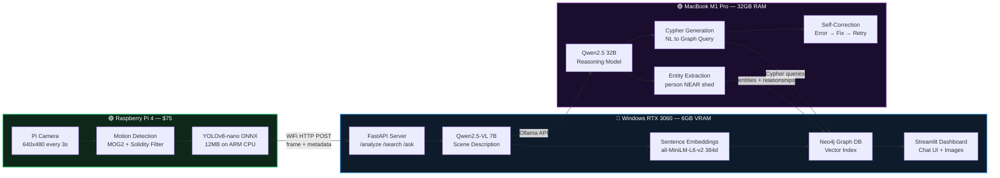

```mermaid
flowchart LR
    subgraph EDGE["🟢 Raspberry Pi 4 — $75"]
        CAM[Pi Camera\n640x480 every 3s]
        MOT[Motion Detection\nMOG2 + Solidity Filter]
        YOLO[YOLOv8-nano ONNX\n12MB on ARM CPU]
        CAM --> MOT --> YOLO
    end

    subgraph GPU["🔵 Windows RTX 3060 — 6GB VRAM"]
        API[FastAPI Server\n/analyze /search /ask]
        VLM[Qwen2.5-VL 7B\nScene Description]
        EMB[Sentence Embeddings\nall-MiniLM-L6-v2 384d]
        NEO[Neo4j Graph DB\nVector Index]
        DASH[Streamlit Dashboard\nChat UI + Images]
        API --> VLM --> EMB --> NEO
        NEO --> DASH
    end

    subgraph MAC["🟣 MacBook M1 Pro — 32GB RAM"]
        LLM[Qwen2.5 32B\nReasoning Model]
        ENT[Entity Extraction\nperson NEAR shed]
        CYP[Cypher Generation\nNL to Graph Query]
        FIX[Self-Correction\nError → Fix → Retry]
        LLM --> ENT
        LLM --> CYP --> FIX
    end

    YOLO -->|WiFi HTTP POST\nframe + metadata| API
    VLM -->|Ollama API| LLM
    ENT -->|entities + relationships| NEO
    CYP -->|Cypher queries| NEO

    style EDGE fill:#0d2818,stroke:#2ecc71,stroke-width:2px,color:#fff
    style GPU fill:#0d1b2a,stroke:#3498db,stroke-width:2px,color:#fff
    style MAC fill:#1a0d2e,stroke:#9b59b6,stroke-width:2px,color:#fff
```
